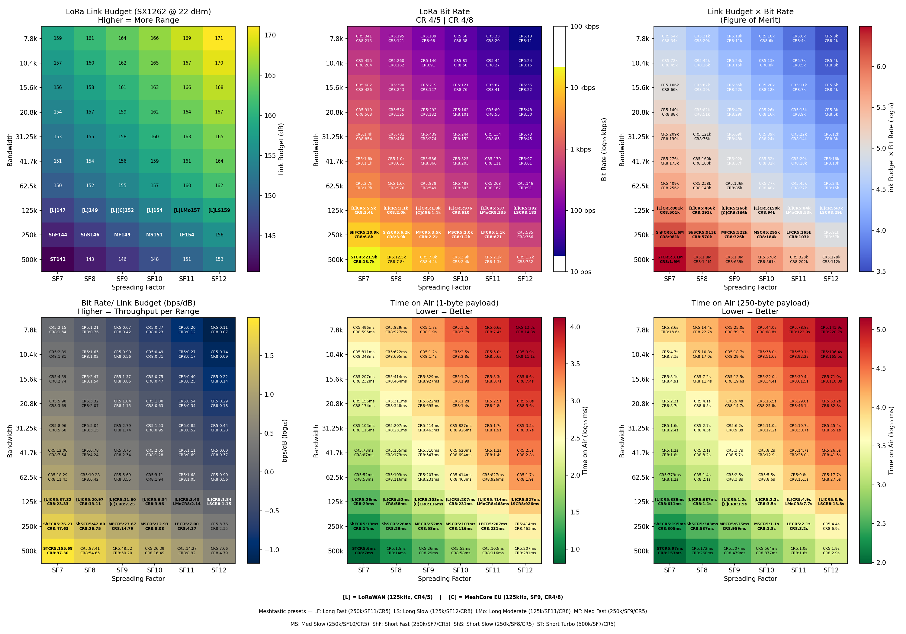

# lora-params-matrix

Generates a comprehensive heatmap visualization of LoRa radio parameters across all bandwidth / spreading factor combinations, with annotations for common protocol presets.

## Output

A 2×3 grid of annotated heatmaps covering:

- **Link Budget** — range potential in dB
- **Bit Rate** — CR4/5 and CR4/8
- **Figure of Merit** — Link Budget × Bit Rate
- **Throughput Efficiency** — bps per dB of link budget
- **Time on Air** — 1-byte payload
- **Time on Air** — 250-byte payload

### Preset annotations

| Label | Protocol | BW / SF / CR |
|-------|----------|--------------|
| `[L]` | LoRaWAN EU868 | 125kHz, any SF, CR4/5 |
| `[C]` | MeshCore EU | 125kHz, SF9, CR4/8 |
| `LF`  | Meshtastic Long Fast | 250kHz, SF11, CR4/5 |
| `LS`  | Meshtastic Long Slow | 125kHz, SF12, CR4/8 |
| `LMo` | Meshtastic Long Moderate | 125kHz, SF11, CR4/8 |
| `MF`  | Meshtastic Medium Fast | 250kHz, SF9, CR4/5 |
| `MS`  | Meshtastic Medium Slow | 250kHz, SF10, CR4/5 |
| `ShF` | Meshtastic Short Fast | 250kHz, SF7, CR4/5 |
| `ShS` | Meshtastic Short Slow | 250kHz, SF8, CR4/5 |
| `ST`  | Meshtastic Short Turbo | 500kHz, SF7, CR4/5 |

## Chart



## Usage

```bash
python lora-params-matrix.py
```

Displays the chart and saves it as `lora_charts.png`.

## Dependencies

```
numpy
matplotlib
```

## Radio parameters

Based on the Semtech SX1261/2 datasheet (Rev 2.2, Dec 2024):

- TX power: +22 dBm (SX1262 max)
- Noise figure: 6 dB
- SNR thresholds: SF7 = −7.5 dB … SF12 = −20 dB (Table 6-1)
- LDRO enabled when symbol time ≥ 16.38 ms
